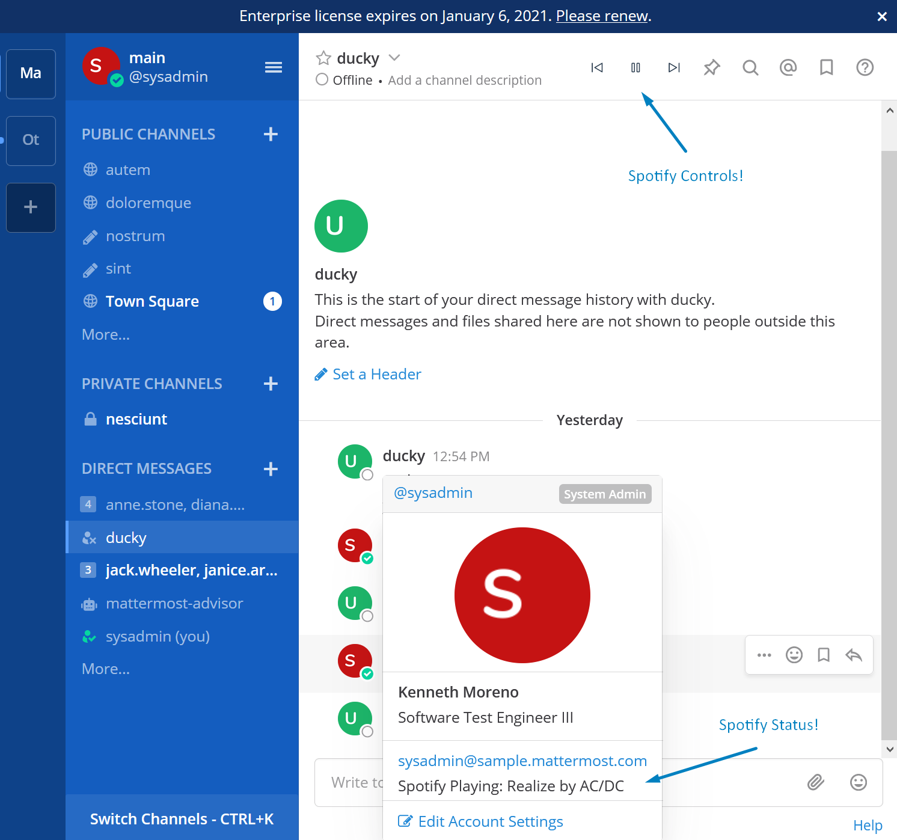

# Mattermost Spotify integration

1. Create a new Spotify App in developer console https://developer.spotify.com/dashboard/applications
2. Install this plugin
3. In Mattermost Plugin Settings - enter Client ID and Secret for your Spotify App
4. As a user that wants to a) publish their Spotify status b) control their Spotify player - do `/spotify enable your.spotify@email.com` and finish the authentication.

Enjoy!

